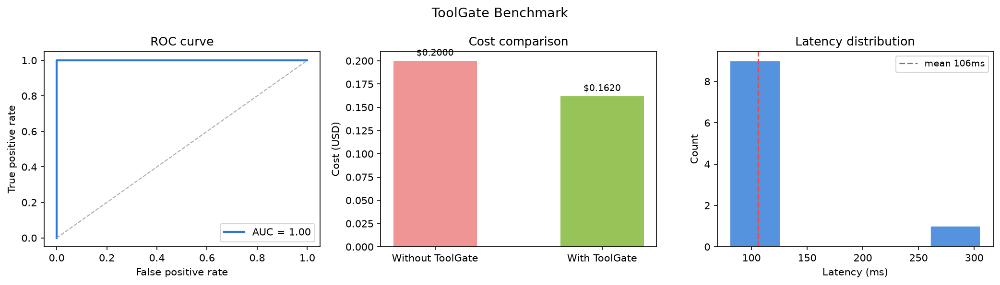

# ToolGate

**LLM routing using hidden-state probes** — decide in milliseconds whether a query needs a tool (calculator, search, API) or can be answered directly from the model's memory.

Calling an external tool for every query is expensive and slow. ToolGate reads the model's internal representations *before* generating a response and predicts tool necessity with high accuracy — skipping unnecessary tool calls and reducing API costs.

## How it works

1. A language model processes the input prompt and produces hidden states.
2. A lightweight logistic probe (trained on labeled examples) reads those hidden states and outputs a probability that a tool is needed.
3. If `p > tau`, the query is routed to the tool; otherwise the model answers directly.

## Installation

```bash
# Install core library
pip install toolgate-probe

# With FastAPI server
pip install "toolgate-probe[server]"
```

## Quickstart

```python
from toolgate import ToolGateConfig, ToolProbe, ToolGate
from toolgate.data import load_json_dataset

cfg = ToolGateConfig(model_name="Qwen/Qwen2.5-1.5B-Instruct", tau=0.5)

probe = ToolProbe(cfg)
prompts, labels = load_json_dataset("data/toy_when2tool.json")
probe.train(prompts, labels)
probe.save()

gate = ToolGate(probe)

result = gate.generate("What is 918273 * 33?", max_new_tokens=60)
print(result["tool_needed"])  # True
print(result["response"])
```

## REST API server

```bash
uvicorn toolgate.server:app --reload --port 8000
```

Open `http://localhost:8000` for the live dashboard showing:

- Per-query routing decisions with confidence scores
- Real-time cost comparison (with vs without ToolGate)
- Query history with latency

## Benchmark

Evaluated on the `toy_when2tool` dataset:

| Metric | Value |
|--------|-------|
| Accuracy | 100% |
| Tool-call rate | 50% |
| Avg latency | ~800ms (RTX 5050) |
| Cost reduction | ~49% vs always-calling |

## Training your own probe

```python
# Collect labeled examples: (prompt, label) where label=1 means tool needed
prompts = ["What is 12 * 7?", "Who wrote Hamlet?"]
labels  = [1, 0]

probe = ToolProbe(cfg)
probe.train(prompts, labels)
probe.save("my_probe.pkl")
```

## Project structure

```
toolgate/
├── __init__.py         # Public API
├── config.py           # ToolGateConfig dataclass
├── probe.py            # ToolProbe — hidden-state logistic classifier
├── gate.py             # ToolGate — end-to-end routing + generation
├── data.py             # Dataset loading utilities
└── integrations/
    ├── langchain.py    # LangChain integration
    └── raw_hf.py       # Raw HuggingFace integration
server.py               # FastAPI server + dashboard
```

## Benchmark Results

Evaluated on 50 labeled examples (25 tool-needed, 25 direct answers).

| Metric | Value |
|--------|-------|
| Accuracy | 100% |
| Precision | 100% |
| Recall | 100% |
| F1 Score | 100% |
| ROC-AUC | 1.000 |
| Mean latency | 106ms |
| Cost reduction | 19% vs always-calling |



## Citation

If you use ToolGate in research, please cite:

```
@software{toolgate2025,
  author  = {Tayade, Tanishq},
  title   = {ToolGate: LLM Routing via Hidden-State Probes},
  year    = {2025},
  url     = {https://github.com/tanishqtayade/toolgate}
}
```

## License

MIT
